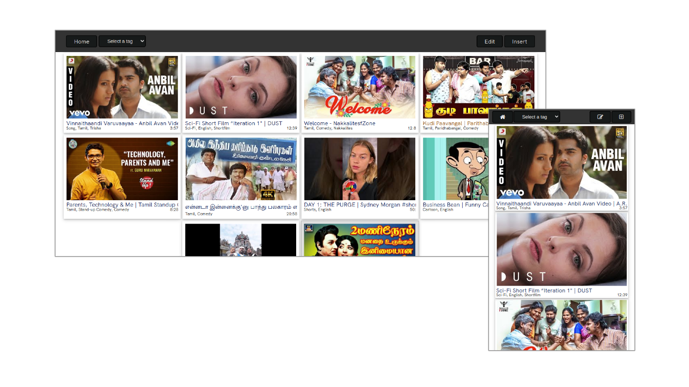
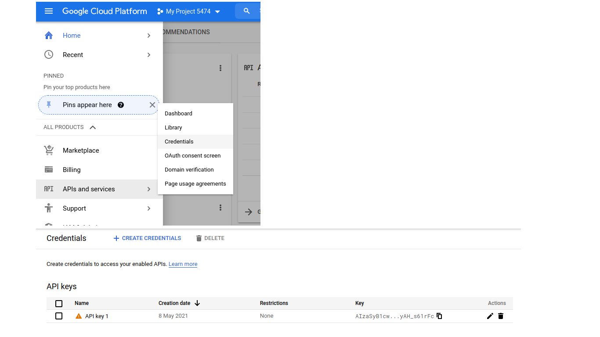

<h1>YouTube Favourite Vidoes Organiser </h1>
<h6> (Still Under Development) </h6>
<b> URL : </b>
<a href="https://ytfvo.herokuapp.com/"> https://ytfvo.herokuapp.com </a> and  
<a href="http://ytfvo.infinityfreeapp.com/"> http://ytfvo.infinityfreeapp.com </a>

<h3> Features </h3>
<ul>
    <li>User accounts</li>
    <li>Add Your Favourite YouTube Videos by Specifying URL and Tags. </li>
    <li>Saves the Data in Database. </li>
    <li>Fetches Thumbnails, Title and Duration Automatically using YouTube API. </li>
    <li>Edit/Delete using Edit Mode. </li>
    <li>Filter Based on the Tags provided, using the drop down. </li>
    <li>Responsive Model. (Can view in Mobile too) </li>
</ul>
<b> Language : </b> PHP, HTML and CSS (Bootstrap)  
<b> Deployed on : </b> <a href="https://infinityfree.net/"> Infinityfree.net</a> and <a href="https://herokuapp.com/"> herokuapp.com </a>  
<b> Database : </b> MySQL from Infinityfree and Clever-cloud  
<b> Icons : </b> Bootstrap icons  
<b> Database table structure : </b> Refer SQL.sql in root of the repo  
<h3 style="color:red;">You need your own API Key from Google Cloud Console.</h3>

Fetch API Key from Google Cloud Console as mentioned below. (If you don't have a key already, you might need to create one)

Then save the key in a table. (I have mentioned the table structure.)

