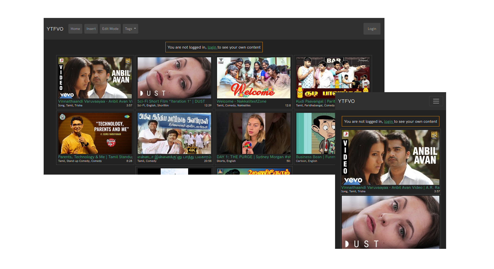

<h1>YouTube Favourite Vidoes Organiser </h1>
<h6> (Still Under Development) </h6>

<h3> Features </h3>
<ul>
    <li>Insert Your Favourite YouTube Videos Manually by Specifying URL and Tags. </li>
    <li>Saves the Data in Database. </li>
    <li>Fetches Thumbnails, Title and Duration Automatically using YouTube API. </li>
    <li>Edit/Delete using Edit Mode. </li>
    <li>Filter Based on the Tags provided, using drop down option. </li>
    <li>Responsive Model. (Can view in Mobile too) </li>
</ul>
<b> Language : </b> PHP, HTML and CSS  
<b> Deployed on : </b> <a href="https://infinityfree.net/"> Infinityfree.net</a>  
<b> Database : </b> MySQL from Infinityfree  
<b> Icons : </b> Font Awesome  
<h3 style="color:red;">You need your own API Key from Google Cloud Console.</h3>

Fetch API Key from Google Cloud Console as mentioned below. (If you don't have a key already, you might need to create one)

Then save the key in a table. (I have mentioned the table structure below.)

<h2>Table structure :</h2>

Note : The <b>id</b> column in ytfvo-credentials is just a random number, and not any secific id, <b>name</b> holds the variable name (apikey) and <b>value</b> holds the actual key
